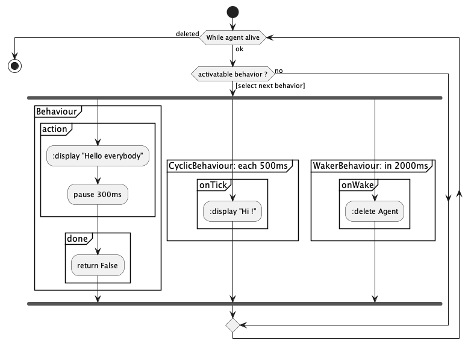
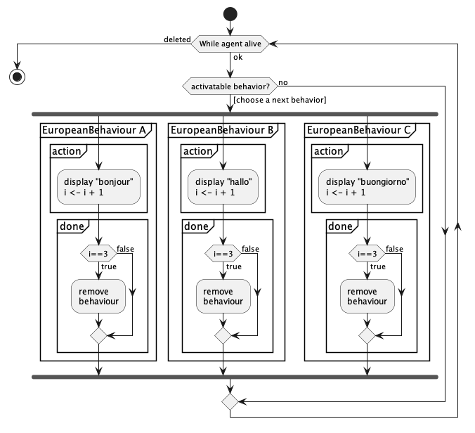
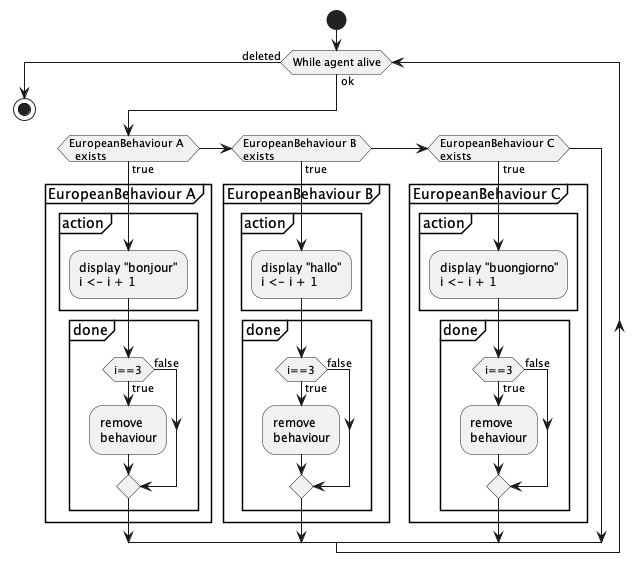

# Jade : Agents

## Exemple de comportements sur un agent "Hello World"

---

- [AgentHelloSalut](https://github.com/EmmanuelADAM/jade/blob/english/behaviorTests/AgentHelloSalut.java) : code for an 
  agent that owns 3 behaviors:
    - a behavior displaying "hello" every 300ms, endlessly
    - a cyclic behavior with activation every 500ms
    - a delayed behavior causing the removal of the agent after 2000ms
    - initially, 2 agents are launched.
<!--
```
@startuml helloSalut

start
while (While agent alive) is (ok)
if (activatable behavior ?) then ([select next behavior])
    fork
    partition "Behaviour" {
      partition "action" {
          ::display "Hello everybody";
          :pause 300ms;
      }
      partition "done" {
          :return False;
      }
    }
    fork again
    partition "CyclicBehaviour: each 500ms" {
      partition "onTick" {
          ::display "Hi !";
      }
    }
    fork again
    partition "WakerBehaviour: in 2000ms" {
      partition "onWake" {
          ::delete Agent;
      }
    }
    end fork
 else(no)
 endif 
  endwhile (deleted)
stop

@enduml```
-->



- [AgentHelloEuropeenParallel](https://github.com/EmmanuelADAM/jade/blob/english/behaviorTests/AgentHelloEuropeenParallel.java) :
  code that launches 2 agents that owns behaviors executing in **parallel**. These behaviors can be activated 3 
  times and display greetings in European languages..
- The results shown that JADE share ressources between agents and their behaviors receive the same priority.

- Here is a view of how behaviors work in parallel.


<!--
```
@startuml HelloEuropeenParallel

start
while (While agent alive) is (ok)
if (activatable behavior?) then ([choose a next behavior])
    fork
    partition "EuropeanBehaviour A" {
      partition "action" {
          :display "bonjour"
          i <- i + 1;
      }
      partition "done" {
      if (i==3) then (true)
        :remove 
        behaviour;
      else (false)
      endif 
      }
    }
    fork again
    partition "EuropeanBehaviour B" {
      partition "action" {
          :display "hallo"
          i <- i + 1;
      }
      partition "done" {
      if (i==3) then (true)
        :remove 
        behaviour;
      else (false)
      endif 
      }
    }
    fork again
    partition "EuropeanBehaviour C" {
      partition "action" {
          :display "buongiorno"
          i <- i + 1;
      }
      partition "done" {
      if (i==3) then (true)
        :remove 
        behaviour;
      else (false)
      endif 
      }
    }
    end fork
else (no)
 endif 
  endwhile (deleted)
stop

@enduml```
-->



```
a1 -> bonjour (1/3)
a2 -> bonjour (1/3)
a1 -> hallo (1/3)
a2 -> hallo (1/3)
a1 -> buongiorno (1/3)
a2 -> buongiorno (1/3)
a1 -> buenos dias (1/3)
a2 -> buenos dias (1/3)
a1 -> Olá (1/3)
a2 -> Olá (1/3)
a1 -> saluton (1/3)
a2 -> saluton (1/3)
a1 -> bonjour (2/3)
a2 -> bonjour (2/3)
a1 -> hallo (2/3)
a2 -> hallo (2/3)
a1 -> buongiorno (2/3)
a2 -> buongiorno (2/3)
a1 -> buenos dias (2/3)
a2 -> buenos dias (2/3)
...
```

- [AgentHelloEuropeenSequentiel](https://github.com/EmmanuelADAM/jade/blob/english/behaviorTests/AgentHelloEuropeenSequentiel.java) :
  code that launches 2 agents that owns behaviors executing in **sequence**. These behaviors can be activated 3
  times and display greetings in European languages..
- The results shown that JADE share ressources between agents and their behaviors receive the same priority. This time, for each agent, the same behavior is called until it completes, with the other behaviors executing in the order of their declarations.

- Here is a view of how behaviors work in sequence.
<!--
```
@startuml HelloEuropeenSequentiel

start
while (While agent alive) is (ok)
  if (EuropeanBehaviour A 
  exists) then (true)
    partition "EuropeanBehaviour A" {
      partition "action" {
          :display "bonjour"
          i <- i + 1;
      }
      partition "done" {
      if (i==3) then (true)
        :remove 
        behaviour;
      else (false)
      endif 
      }
    }
  elseif (EuropeanBehaviour B 
exists) then (true)
    partition "EuropeanBehaviour B" {
      partition "action" {
          :display "hallo"
          i <- i + 1;
      }
      partition "done" {
      if (i==3) then (true) 
        :remove 
        behaviour;
      else (false)
      endif 
      }
    }
  elseif (EuropeanBehaviour C 
exists) then (true)
    partition "EuropeanBehaviour C" {
      partition "action" {
          :display "buongiorno"
          i <- i + 1;
      }
      partition "done" {
      if (i==3) then (true)
        :remove 
        behaviour;
      else (false)
      endif 
      }
    }
  endif
  endwhile (deleted)
stop

@enduml```
-->



```
a1 -> bonjour (1/3)
a2 -> bonjour (1/3)
a1 -> bonjour (2/3)
a2 -> bonjour (2/3)
a2 -> bonjour (3/3)
a1 -> bonjour (3/3)
a2 -> hallo (1/3)
a1 -> hallo (1/3)
a2 -> hallo (2/3)
a1 -> hallo (2/3)
a2 -> hallo (3/3)
a1 -> hallo (3/3)
a2 -> buongiorno (1/3)
a1 -> buongiorno (1/3)
a2 -> buongiorno (2/3)
a1 -> buongiorno (2/3)
a2 -> buongiorno (3/3)
a1 -> buongiorno (3/3)
a2 -> buenos dias (1/3)
a1 -> buenos dias (1/3)
a2 -> buenos dias (2/3)
a1 -> buenos dias (2/3)
a2 -> buenos dias (3/3)
a1 -> buenos dias (3/3)
a2 -> Olá (1/3)
...
```