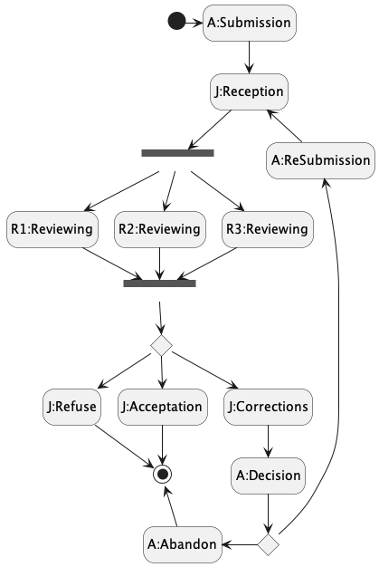

# Jade : Agents et states behaviors

## FMS : Finite State Machine

---

Jade Agent-Oriented Programming Course Materials


- In the package [Review](https://github.com/EmmanuelADAM/jade/blob/master/fsm/review/)  agents simulate the
  principle of depositing a research article:
    - an author submits an article to a journal
    - this journal receives it and sends this article to 3 reviewers
    - when all 3 evaluations are received (a score of 0 to 2),
        - if a 0 is received, the item is refused
        - if all marks are 2, the article is accepted without modification
        - otherwise it is proposed to the author to correct
    - if the author agrees to correct, he returns the document to the journal (return step 2)
    - otherwise, he refuses to continue and informs the newspaper.

<!-- 
```
@startuml fsmReview
!pragma layout smetana

hide empty description

[*] -> A:Submission
A:Submission -- > J:Reception
state JDispatch <<fork>>
J:Reception -- > JDispatch
JDispatch -- > R1:Reviewing
JDispatch -- > R2:Reviewing
JDispatch -- > R3:Reviewing
state JCollect <<fork>>
R1:Reviewing -- > JCollect
R2:Reviewing -- > JCollect
R3:Reviewing -- > JCollect
state resultat <<choice>>
JCollect -- > resultat
resultat -- > J:Refuse
resultat -- > J:Acceptation
resultat -- > J:Corrections
J:Refuse -- > [*]
J:Acceptation -- > [*]
J:Corrections -- > A:Decision 
state decision <<choice>>
A:Decision -- > decision
A:ReSubmission <-- decision
A:Abandon <-- decision
J:Reception <-- A:ReSubmission
[*] <- A:Abandon 
@enduml```
-->



