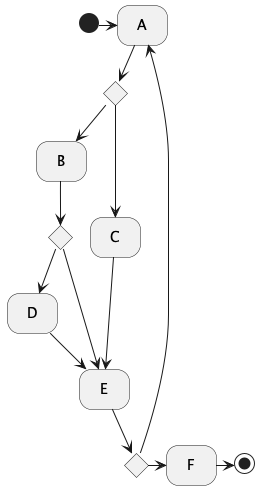

# Jade : Agents et states behaviors

## FMS : Finite State Machine

---

Jade Agent-Oriented Programming Course Materials

- [AgentHelloEuropeenFSM](https://github.com/EmmanuelADAM/jade/blob/master/fsm/salutations/AgentHelloEuropeenFSM.java) :
  code for an agent that organizes 6 greeting behaviors according to a finite state machine.
  - it starts performing behavior A (initial state), then performs B or C depending on the result of A.
  - according to the return of B, executes D or E
  - end of C, end of D lead to E
  - E leads to F (final state) or returns to A

<!-- 
```
@startuml fsmSalutations
!pragma layout smetana
hide empty description

[*] -> A
state choiceFromA <<choice>>
A -- > choiceFromA
choiceFromA -- > B
choiceFromA -- > C
state choiceFromB <<choice>>
B -- > choiceFromB
choiceFromB -- > D
choiceFromB -- > E
state synchroCD <<fork>>
C-> synchroCD
D -- > synchroCD
synchroCD -- > E
state choiceFromE <<choice>>
choiceFromE <- E  
A <- choiceFromE 
choiceFromE -> F
F -- > [*]

@enduml```

-->


