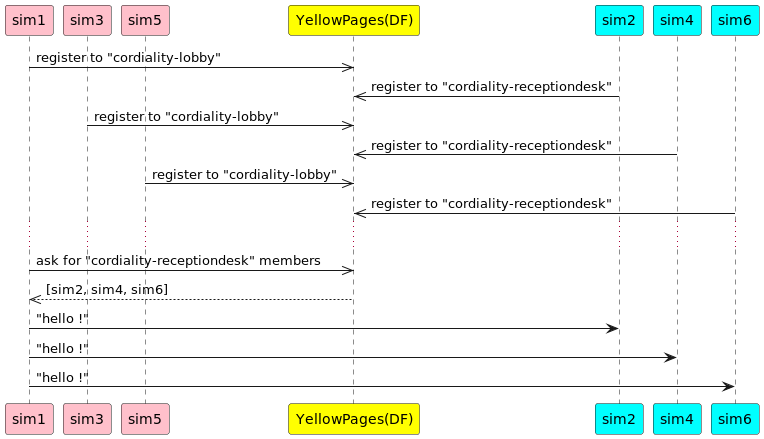

# Jade : Agents

## Exemple d'inscription à un service et d'utilisation des Pages Jaunes

### Jade Agent-Oriented Programming Course Materials

---

- [HelloAgent](https://github.com/EmmanuelADAM/jade/blob/english/HelloWorldService/agents/HelloAgent.java) : is a 
  class of agent linked to a grapichal window
    - The agent registers in the yellow pages in the "cordiality" type service, and randomly in the "receptiondesk" or 
      "lobby" sub-service
    - the agent can send a message to all the agent in the service "receptiondesk" or "lobby"
        - To do this, it asks the yellow pages for the list of agents in a service.
    - The agent listens and displays the message sent to it
  - [SimpleGui4Agent](https://github.com/EmmanuelADAM/jade/blob/english/HelloWorldService/gui/SimpleGui4Agent.java) : a 
    small java swing window for a *GuiAgent*.

- [LaunchAgents](https://https://github.com/EmmanuelADAM/jade/blob/english/helloWorldService/launch/LaunchAgents.java)
  : **main class**, launch Jade et creates the agents

- At launch, 10 agents are created, the number is not limited except by the capacity of the machine. 

Here are an example of msg exchanged between the agents:

<!--
```
@startuml helloService

participant sim1 #pink
participant sim3 #pink
participant sim5 #pink
participant "YellowPages(DF)" as df #yellow 
participant sim2 #cyan
participant sim4 #cyan
participant sim6 #cyan

sim1 ->> df: register to "cordiality-lobby"
df <<- sim2: register to "cordiality-receptiondesk"
sim3 ->> df: register to "cordiality-lobby"
df <<- sim4: register to "cordiality-receptiondesk"
sim5 ->> df: register to "cordiality-lobby"
df <<- sim6: register to "cordiality-receptiondesk"
...
sim1 ->> df: ask for "cordiality-receptiondesk" members
df -- >> sim1 : [sim2, sim4, sim6]
sim1 -> sim2: "hello !"
sim1 -> sim4: "hello !"
sim1 -> sim6: "hello !"
@enduml```
-->



