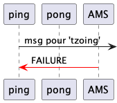

# Jade : Agents et communication

## Exemple basique : le "Ping"-"Pong" en Jade

---

Supports pour le cours de programmation orientée agent en Jade

- [AgentPingPlouf](https://github.com/EmmanuelADAM/jade/blob/master/pingPong/AgentPingPlouf.java) : code pour un agent qui
  possède envoie un message à un agent n'existant  pas (tzoing) et attends une réponse..! Celle-ci viendra de l'agent 
  des pages blanches (AMS) lui signifiant qu'il n'y a personne à l'adresse indiquée...

---

<!--
```
@startuml pingplouf
participant ping
participant pong
participant AMS 

ping ->] : msg pour 'tzoing'
AMS -[#red]> ping :  FAILURE 
@enduml
```
-->

