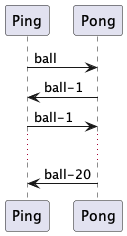

# Jade : Agents and communication

## Basic example : "Ping"-"Pong" in Jade

---

Jade Agent-Oriented Programming Course Materials

- [AgentPingPong](https://github.com/EmmanuelADAM/jade/blob/english/pingPong/AgentPingPong.java) : code for an agent 
  that has 2 communication behaviors :
    - if the agent is called 'ping', it sends a message containing the string "ball" a few seconds after its 
      activation to an agent called "pong"
    - whatever the name of the agent, it has a behavior that runs 20 times :
        - mailbox reading,
        - display of the received message and its sender,
        - return to sender content "balle-x" where x is the number of the returned message
    - this behavior ends after a certain number of cycles.
    - at start, 2 agents are therefore launched: ping & pong..

Here is the behavior of the player agents: 
<!--
```
@startuml compPingPong

start
while (While agent alive) is (ok)
if (activatable behavior?) then ([yes, select one (the only one here)])
    partition "Behaviour:pingpong" {
      partition "action" {
          :msg <- takeMessage();
          if (msg ≠ none) then ([yes])
            :dsplay msg;
            :answers "ball-" + i;
            :i <- i + 1;
          endif
      }
      partition "done" {
          if (i=20) then ([yes])
            :behavior \nremoved;
          endif
      }
    }

 endif 
  endwhile (deleted)
stop

@enduml```
-->


Here are the msg exchanged between the agents: 

<!--
```
@startuml pinpong

Ping -> Pong: ball
Pong -> Ping: ball-1
Ping -> Pong: ball-1
...
Pong -> Ping: ball-20

@enduml```
-->





---