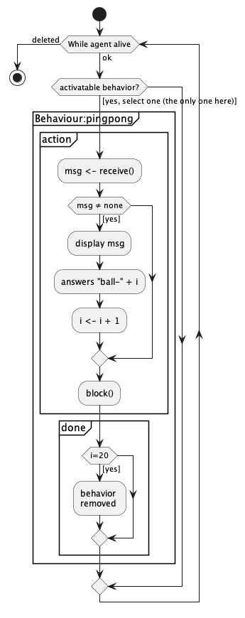
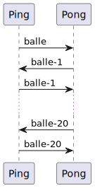

# Jade : Agents et communication

## Exemple basique : le "Ping"-"Pong" en Jade

---

Supports pour le cours de programmation orientée agent en Jade

- [AgentPingPong](https://github.com/EmmanuelADAM/jade/blob/master/pingPong/AgentPingPong.java) : code pour un agent qui
  possède 2 comportements de communication :
    - si l'agent s'appelle 'ping', il émet quelques secondes après son activation un message contenant la chaine "balle"
      à un agent s'appelant "pong"
    - quel que soit le nom de l'agent, il possède un comportement qui s'exécute 20 fois :
        - de lecture de boite aux lettres,
        - d'affichage du message reçu et de son émetteur
        - de retour à l'envoyeur du contenu "balle-x" où x est le no du message retourné
    - ce comportement qui prend fin après un certain nombre de cycles.
    - au lancement, 2 agents sont donc lancés : ping & pong..

Voici le comportement des joueurs : 
<!--
```
@startuml compPingPong

start
while (TQ agent vivant) is (ok)
if (comportement activable ?) then ([choisir prochain comportement])
    partition "Behaviour:pingpong" {
      partition "action" {
          :msg <- prendreMessage();
          if (msg ≠ vide) then 
            :afficher msg;
            :répondre "balle-" + i;
            :i <- i + 1;
          endif
      }
      partition "done" {
          if (i=20) then
            :removeBehaviour pingpong;
          endif
      }
    }

 else(non)
 endif 
  endwhile (deleted)
stop

@enduml```
-->



Voici les messages échangés entre les agents : 

<!--
```
@startuml pinpong

Ping -> Pong: balle
Pong -> Ping: balle-1
Ping -> Pong: balle-1
...
Pong -> Ping: balle-20
Ping -> Pong: balle-20

@enduml```
-->





---