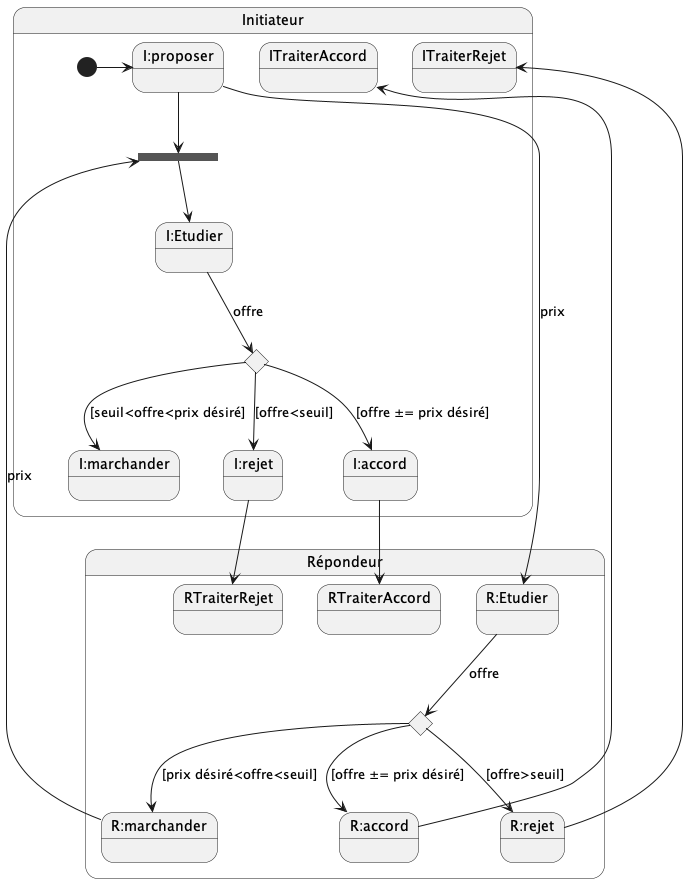

# Jade : Agents et négociation

## Exemple basique : la négociation 1-1 

---

Sur base du code sur le [PingPong](https://github.com/EmmanuelADAM/jade/blob/master/pingPong/), deux agents 
vendeur et acheteur négocient autour d'un prix.

Etendez les classes suivantes pour coder complètement la négociation (prise en compte des 2 parties sur les cas 
d'accord, de rejet, de nb de tours dépassé).


- [Negociateur](https://github.com/EmmanuelADAM/jade/blob/master/protocoles/negociation/Negociateur.java) : code 
  pour un agent qui possède le comportement CompAcheteur s'il se nomme acheteur, CompVendeur s'il se nomme vendeur.
  - Un négociateur a un seuil qu'il ne souhaite pas dépasser
  - ainsi qu'un prix de base idéal
  - le vendeur initie la négociation

- [CompAcheteur](https://github.com/EmmanuelADAM/jade/blob/master/protocoles/negociation/CompAcheteur.java) : code
  pour un comportement d'acheteur. 
  - il attend une offre :
    - si elle est inacceptable, il y a rejet (offre autre > seuil)
    - si elle est acceptable, il y a accord (offre autre <=offre précédemment émise)
    - sinon une nouvelle offre est faite, un peu plus élevée que la précédente
  - le comportement prend fin en cas d'accord, de rejet, ou au bout de nb cycles

- [CompVendeur](https://github.com/EmmanuelADAM/jade/blob/master/protocoles/negociation/CompVendeur.java) : code
  pour un comportement de vendeur.
    - il attend une offre :
        - si elle est inacceptable, il y a rejet (offre autre < seuil)
        - si elle est acceptable, il y a accord (offre autre >= offre précédemment émise)
        - sinon une nouvelle offre est faite, un peu moins élevée que la précédente
    - le comportement prend fin en cas d'accord, de rejet, ou au bout de nb cycles

---
**Créez un procotole en se basant sur les automates (FSM)**

Modifier le code de ce répoertoire; voici ci-dessous l'enchaînement des étapes.
- L'initiateur propose un prix,
- Le prix proposé devient une offre pour le destinataire du message
- Ce destinataire : 
  - accepte si l'offre est proche de son prix désiré,
  - refuse si l'offre dépasse un seuil (trop haut ou trop bas selon la position du négociateur),
  - émet une contre-offre et retourne un prix au partenaire.

<!-- 
```
@startuml negociation
State Initiateur{
[*] -> I:proposer
state IattenteOffre <<fork>>
I:proposer -- > IattenteOffre
state choixInitiateur <<choice>>
IattenteOffre -- > I:Etudier
I:Etudier -- > choixInitiateur : offre
choixInitiateur -- > I:rejet : [offre<seuil]
choixInitiateur -- > I:accord : [offre ±= prix désiré]
choixInitiateur -- > I:marchander : [seuil<offre<prix désiré]
state ITraiterAccord
state ITraiterRejet
}

State Répondeur{
I:proposer -> R:Etudier : prix
state choixRepondeur <<choice>>
R:Etudier -- > choixRepondeur : offre
choixRepondeur -- > R:rejet : [offre>seuil]
choixRepondeur -- > R:accord : [offre ±= prix désiré]
choixRepondeur -- > R:marchander : [prix désiré<offre<seuil]
R:marchander -- > IattenteOffre : prix
state RTraiterAccord
state RTraiterRejet
}
ITraiterAccord<-R:accord
ITraiterRejet<-R:rejet
I:accord-- >RTraiterAccord
I:rejet-- >RTraiterRejet
@enduml```
-->



---