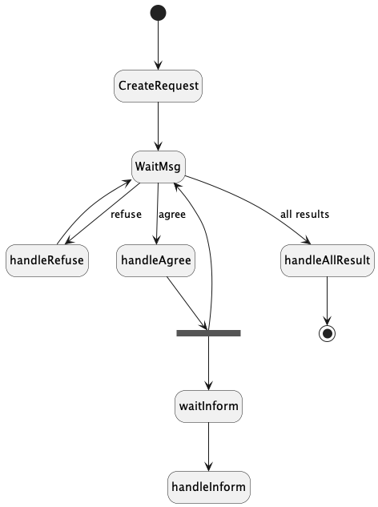
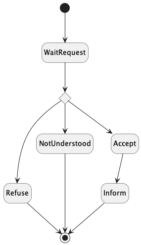

# Jade : Agents, protocole et services

## Exemple : FIPA Request Interaction Protocole en Jade

### Et utilisation de services

---

Ici, vous trouverez un exemple de communication via le
protocole [FIPA Request Interaction](http://www.fipa.org/specs/fipa00026/SC00026H.html)

- un agent de
  type [AgentEmissionARE](https://github.com/EmmanuelADAM/jade/blob/master/protocoles/requetes/agents/AgentEmissionARE.java)
  émet une requête
- auprès d'agents de
  type [AgentReceptionARE](https://github.com/EmmanuelADAM/jade/blob/master/protocoles/requetes/agents/AgentReceptionARE.java)
- Le protocole oblige les destinataires à répondre (refus, erreur, accord) et à informer d'un résultat en cas d'accord.
  L'émetteur doit donc prévoir de traiter ces différents messages de retour. L'utilisation de protocole facilite cette
  prise en charge des échanges

Protocole de l'agent émettant la requête : 
<!--
```
@startuml RequestInitiator

hide empty description
[*] --> CreateRequest
CreateRequest --> WaitMsg
WaitMsg-->handleRefuse : refuse
handleRefuse --> WaitMsg

WaitMsg-->handleAgree : agree
state forkAgree   <<fork>>
handleAgree --> forkAgree
forkAgree --> waitInform
forkAgree --> WaitMsg
waitInform --> handleInform


WaitMsg-->handleAllResult : all results
handleAllResult --> [*]

@enduml```
-->



Protocole de l'agent recevant la requête :
<!--
```
@startuml RequestResponder

hide empty description
[*] --> WaitRequest
state answerChoice <<choice>>
WaitRequest-->answerChoice
answerChoice --> Refuse
answerChoice --> NotUnderstood
answerChoice --> Accept
Accept--> Inform
Refuse --> [*]
NotUnderstood --> [*]
Inform --> [*]

@enduml```
-->



L'exemple ici utilise la notion de services.

- L'émetteur envoie une requête de calcul sous la forme "sum 4,5,6" auprès d'agents de calcul
- Les agents inscrits au service de calcul reçoivent cette requête et chacun décide de la traiter ou non
- Si la requête est acceptée, l'agent calcule la somme et retourne son résultat


- [LaunchAgents](https://https://github.com/EmmanuelADAM/jade/blob/master/protocoles/requetes/launch/LaunchAgents.java) : **
  classe principale**, lançant Jade et créant les agents
    - Au lancement, 1 émetteur, 10 destinataires sont lancés.


- Il est possible de modifier le code pour que "a" émette plusieurs requêtes

 ---