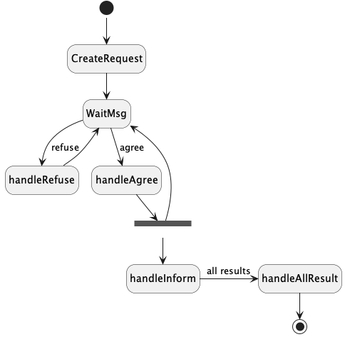
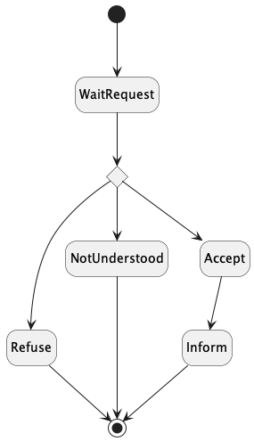

# Jade : Agents and protocols

##  FIPA Request Protocol example

---
### Jade Agent-Oriented Programming Course Materials

---

---

Here you will find an example of communication via the [FIPA Request Interaction](http://www.fipa.org/specs/fipa00026/SC00026H.html) protocol.

- A 
[AgentRequestSender](https://github.com/EmmanuelADAM/jade/blob/english/protocoles/requests/agents/AgentRequestSender.java)
  agent (a sum : "34+12+45" for example)
sends a requests to  [AgentRequestResponder](https://github.com/EmmanuelADAM/jade/blob/english/protocols/requests/agents/AgentRequestResponder.java) agents that agree to answer 
  or refuse.
- The AchieveRE  protocol obliges the recipients to respond (refusal, error, agreement) and to inform of a result 
  in case of agreement.
- The sender must therefore plan to process these different return messages. The use of protocol facilitates this support of exchanges
- [LaunchAgents](https://https://github.com/EmmanuelADAM/jade/blob/english/protocols/requests/launch/LaunchAgents.
  java) : **main class**, launches Jade and creates 10 agents: 1 Sender, 10 responders.

Protocol for the sender: 

<!--
```
@startuml RequestInitiator
!pragma layout smetana

hide empty description
[*] -- > CreateRequest
CreateRequest -- > WaitMsg
WaitMsg-- >handleRefuse : refuse
handleRefuse -- > WaitMsg

WaitMsg-- >handleAgree : agree
state forkAgree   <<fork>>
handleAgree -- > forkAgree
forkAgree -- > handleInform
forkAgree -- > WaitMsg


handleInform->handleAllResult : all results
handleAllResult -- > [*]

@enduml```
-->




Protocol for the responder:


<!--
```
@startuml RequestResponder

hide empty description
[*] -- > WaitRequest
state answerChoice <<choice>>
WaitRequest-- >answerChoice
answerChoice -- > Refuse
answerChoice -- > NotUnderstood
answerChoice -- > Accept
Accept-- > Inform
Refuse -- > [*]
NotUnderstood -- > [*]
Inform -- > [*]

@enduml```
-->



---