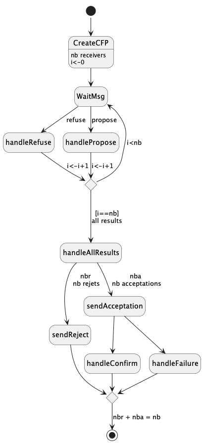
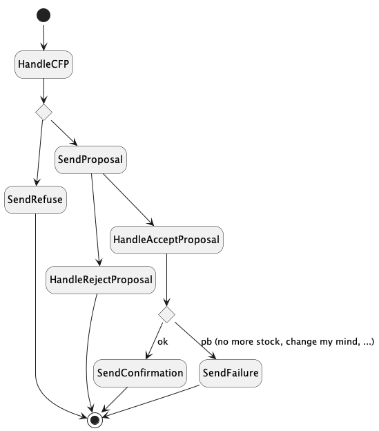
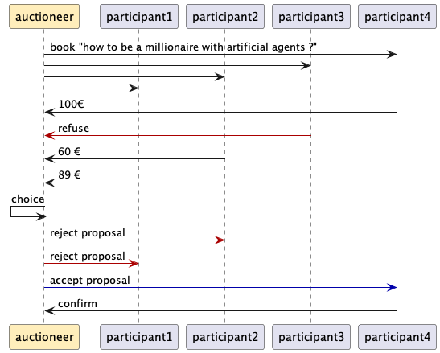

# Jade : Agents and protocols

##  FIPA Contract-Net Protocol example

---
### Jade Agent-Oriented Programming Course Materials
#### Sealed English Auction


--- 

Here, you can find an example of communication through the well known Contract-Net protocol [FIPA Contract Net](http://www.fipa.org/specs/fipa00029/SC00029H.html).
A ``first-price sealed-bid'' is an english auction with only 1 round; it is in fact just a simple call for proposal.
The participant who proposed the most interesting offer wins the auction.<br>
It is up to you to define what a "best" proposition is.


- an [AuctioneerAgent](https://github.com/EmmanuelADAM/jade/blob/master/protocoles/anglaisesscellees/agents/AuctioneerAgent.java) agents launches a call for bid to [ParticipantAgent](https://github.com/EmmanuelADAM/jade/blob/master/protocoles/anglaisesscellees/agents/AgentParticipant.java) agents
- The protocol obliges:
    - the participants to answer (refuse, error, proposal)
    - the auctioneer:
        - to choose one proposal and to inform: 
          - the winner(s), if applicable, that it/they has/ve been selected
          - the others that their proposals are rejected 
    - each winner (if it exists) to confirm or cancel its offer

- the [LaunchAgents](https://https://github.com/EmmanuelADAM/jade/blob/master/protocoles/anglaisesscellees/launch/LaunchAgents.java) *main class*, launches Jade and create the agents
    - 1 auctioneer and 10 participants are created.
    - The auctioneer launches an auction for each activation of the 'go' button...
    - A participant can decide to refuse and to not submit a bid

#### Schema of the behaviour ContractNetInitiator


#### Schema of the behaviour ContractNetResponder


#### Example of sequence diagram : communication between an auctioneer and some participants


---
<!-- for plantuml, remove the space between - and > in the arrows
```
@startuml ContractNetInitiator
!pragma layout smetana

hide empty description
state CreateCFP : nb receivers\ni<-0
[*] -- > CreateCFP
CreateCFP -- > WaitMsg
WaitMsg-- >handleRefuse : refuse
WaitMsg-- >handlePropose : propose
state c <<choice>>
handleRefuse -- > c:i<-i+1
handlePropose -- > c:i<-i+1
c- > WaitMsg:i<nb

c--- > handleAllResults:[i==nb]\nall results


handleAllResults -- > sendReject : nbr\n nb rejets
handleAllResults -- > sendAcceptation :nba\n nb acceptations
sendAcceptation -- > handleConfirm
sendAcceptation -- > handleFailure 
state c2 <<choice>>
sendReject -- > c2
handleFailure -- > c2
handleConfirm -- > c2
c2 -- > [*] : nbr + nba = nb

@enduml```
-->  

<!--
```
@startuml ContractNetResponder
!pragma layout smetana

hide empty description
state HandleCFP 
[*] -- > HandleCFP
state c1 <<choice>>
HandleCFP -- > c1
c1 -- > SendRefuse
SendRefuse -- > [*]
c1 -- > SendProposal
SendProposal -- > HandleRejectProposal
SendProposal -- > HandleAcceptProposal
state c2 <<choice>>
HandleAcceptProposal-- >c2
c2-- >SendConfirmation : ok
c2-- >SendFailure : pb (no more stock, change my mind, ...)
SendConfirmation -- > [*]
SendFailure -- > [*]
HandleRejectProposal -- > [*]
@enduml```
-->


<!--
```
@startuml ContractNetExchanges
!pragma layout smetana
participant auctioneer as a #FFEEBB
participant participant1 as p1
participant participant2 as p2
participant participant3 as p3
participant participant4 as p4
a- > p4 : book "how to be a millionaire with artificial agents ?"
a- > p3
a- > p2
a- > p1
a<-p4 : 100€
a<[#AA0000]-p3  : refuse 
a<-p2 : 60 €
a<-p1 : 89 € 
a<-a : choice
a-[#AA0000]>p2 : reject proposal
a-[#AA0000]>p1 : reject proposal
a-[#0000AA]>p4 : accept proposal
a<-p4 : confirm

@enduml```
-->

---
You can change the code on this page to design a "classic" english auction: 

- the auctioneer : 
  - propose an object with a initial mark
  - wait for bid,
  - repropose the object with the best mark,
  - and so  as long as bids are proposed.

 ---