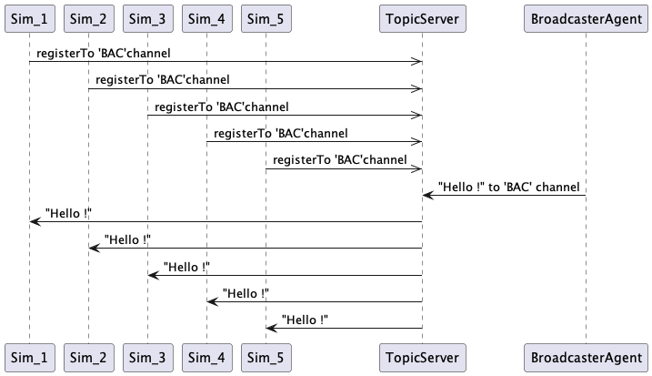

# Jade : Agents, Windows & Communication

## Example of information dissemination by broadcast

---

- [BroadcasterAgent](https://github.com/EmmanuelADAM/jade/blob/english/radio/agents/BroadcasterAgent.java) : class for an 
  agent who broadcasts information on a radio channel
- [ListenerAgent](https://github.com/EmmanuelADAM/jade/blob/english/radio/agents/ListenerAgent.java) : class for an 
  agent who connects to a radio channel to listen to messages and displays them
- [LaunchAgents](https://github.com/EmmanuelADAM/jade/blob/english/radio/launch/LaunchAgents.java) : **main class**, 
  launch Jade and create the agents

- Initially, 10 agents are launched, a transmitter, 9 listeners, their number is not limited except by the capacity of 
  the machine.

Here is the diagram for broadcast communication 
<!--
```
@startuml broadcasting
participant Sim_1
participant Sim_2
participant Sim_3
participant Sim_4
participant Sim_5
Sim_1 ->> TopicServer: registerTo 'BAC'channel
Sim_2 ->> TopicServer: registerTo 'BAC'channel
Sim_3 ->> TopicServer: registerTo 'BAC'channel
Sim_4 ->> TopicServer: registerTo 'BAC'channel
Sim_5 ->> TopicServer: registerTo 'BAC'channel
TopicServer <- BroadcasterAgent : "Hello !" to 'BAC' channel
Sim_1 <- TopicServer: "Hello !"
Sim_2 <- TopicServer: "Hello !"
Sim_3 <- TopicServer: "Hello !"
Sim_4 <- TopicServer: "Hello !"
Sim_5 <- TopicServer: "Hello !"

@enduml```
-->



