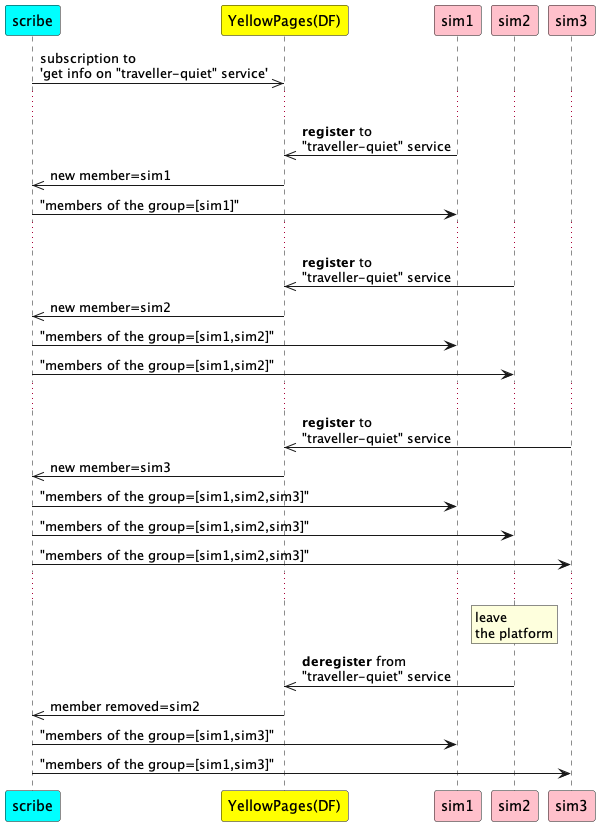

# Jade : Agents

## Detection of Registration to a Service

### Jade Agent-Oriented Programming Course Materials

---

- [IncomingAgent](https://github.com/EmmanuelADAM/jade/blob/english/serviceDetection/agents/IncomingAgent.java) : class
  for an agent who, after a certain period of time, registers for a service. The agent displays the messages it
  receives. Closing the window kills the agent who unsubscribes from his service.
- [ScribeAgent](https://github.com/EmmanuelADAM/jade/blob/english/serviceDetection/agents/ScribeAgent.java) : 
  class for an agent that subscribe to a service proposed by the Yello Pages to receive information about 
  registry/deregistry of agents to a given service. At each arrival and departure, the agent transmits the names of 
  the members of the group.
- [LaunchAgents](https://github.com/EmmanuelADAM/jade/blob/english/serviceDetection/launch/LaunchAgents.java) : **main
  class**, launch Jade and create the agents

- Initially, 10 agents are launched; one scribe and 9 incoming agents.

Here is an example of execution:
<!--
```
@startuml serviceDetection

participant scribe #cyan
participant "YellowPages(DF)" as df #yellow 
participant sim1 #pink
participant sim2 #pink
participant sim3 #pink

scribe ->> df: subscription to \n'get info on "traveller-quiet" service'
...
sim1 ->> df: **register** to \n"traveller-quiet" service
df->> scribe: new member=sim1 
scribe -> sim1: "members of the group=[sim1]"
...
sim2 ->> df: **register** to \n"traveller-quiet" service
df->> scribe: new member=sim2 
scribe -> sim1: "members of the group=[sim1,sim2]"
scribe -> sim2: "members of the group=[sim1,sim2]"
...
sim3 ->> df: **register** to \n"traveller-quiet" service
df->> scribe: new member=sim3 
scribe -> sim1: "members of the group=[sim1,sim2,sim3]"
scribe -> sim2: "members of the group=[sim1,sim2,sim3]"
scribe -> sim3: "members of the group=[sim1,sim2,sim3]"
...
rnote over sim2:leave\nthe platform
sim2 ->> df: **deregister** from \n"traveller-quiet" service
df->> scribe:  member removed=sim2 
scribe -> sim1: "members of the group=[sim1,sim3]"
scribe -> sim3: "members of the group=[sim1,sim3]"

@enduml```
-->



