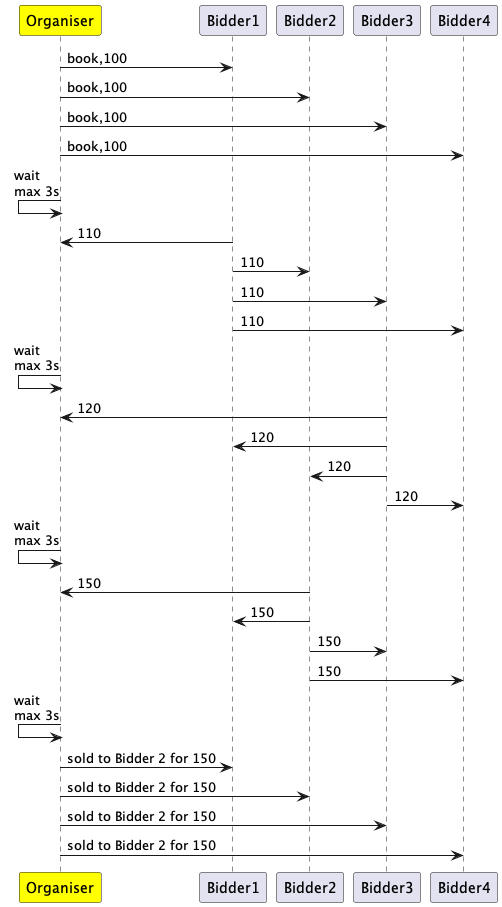

## TD Open Cry First Price

Reprenez le code sur la négociation pour l'étendre à une enchère anglaise classique *(First Price, Open Cry)*.

- Un **organisateur** (ou commissaire priseur) propose un objet à la vente avec un prix initial
- des **enchérisseurs** peuvent proposer des prix, plus haut que le dernier prix entendus
- la vente s'arrête au bout *"d'un certain temps"* après le dernier prix entendu
- le plus haut enchérisseur remporte la vente

<div hidden>
<!--
```
@startuml FPOC
Participant  Organiser#FFFF00
Organiser -> Bidder1: book,100
Organiser -> Bidder2: book,100
Organiser -> Bidder3: book,100
Organiser -> Bidder4: book,100
Organiser <- Organiser : wait\nmax 3s
Bidder1 -> Organiser: 110
Bidder1 -> Bidder2: 110
Bidder1 -> Bidder3: 110
Bidder1 -> Bidder4: 110
Organiser <- Organiser : wait\nmax 3s
Bidder3 -> Organiser: 120
Bidder3 -> Bidder1: 120
Bidder3 -> Bidder2: 120
Bidder3 -> Bidder4: 120
Organiser <- Organiser : wait\nmax 3s
Bidder2 -> Organiser: 150
Bidder2 -> Bidder1: 150
Bidder2 -> Bidder3: 150
Bidder2 -> Bidder4: 150
Organiser <- Organiser : wait\nmax 3s
Organiser -> Bidder1: sold to Bidder 2 for 150
Organiser -> Bidder2: sold to Bidder 2 for 150
Organiser -> Bidder3: sold to Bidder 2 for 150
Organiser -> Bidder4: sold to Bidder 2 for 150
@enduml```
-->
</div>

