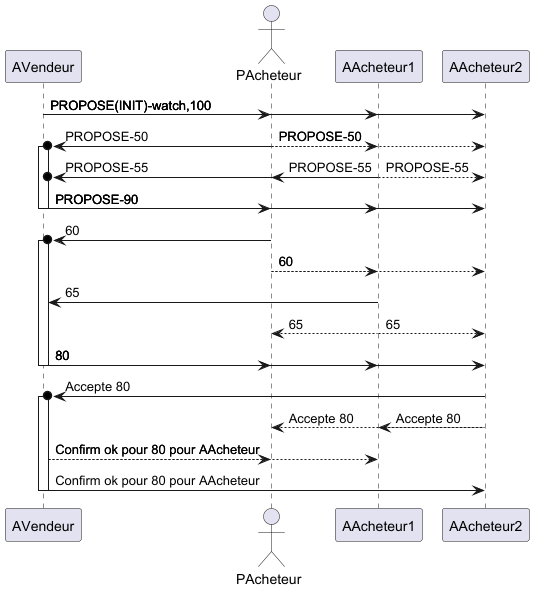

## TD Open Cry First Price

Sur base du code sur le [PingPong](https://github.com/EmmanuelADAM/jade/blob/master/pingPong/), deux agents
vendeur et acheteur négocient autour d'un prix.

Définissez les échanges de message sachant que le vendeur initie la négociation en proposant un prix.
- Le vendeur dispose :
    - d'un prix qu'il propose
    - d'un seuil sous lequel il met fin à la négociation
    - d'un nombre de tours avant de mettre fin à la négociation

- L'acheteur dispose :
    - d'un prix qu'il propose
    - d'un seuil au-dessus lequel il met fin à la négociation
    - d'un nombre de tours avant de mettre fin à la négociation

- pour l'acheteur :
    - si le nb de tours dépasse le nb max, il répond avec un rejet ;
    - si le prix reçu est au-dessus du seuil haut, il répond avec un rejet ;
    - si le prix reçu semblable au prix proposé, il répond avec une confirmation ;
    - si le prix est entre le prix proposé et le seuil, l'acheteur augmente sa proposition initiale de x%.

- pour le vendeur :
    - si le nb de tours dépasse le nb max, il répond avec un rejet ;
    - si le prix reçu est sous le seuil bas, il répond avec un rejet ;
    - si le prix reçu semblable au prix proposé, il répond avec une confirmation ;
    - si le prix est entre le prix proposé et le seuil, le vendeur baisse sa proposition initiale de x%.

Regardez les classes proposées, et lancez le `main` de la classe `Main`.

**Question 1:**
- 1 seul acheteur est un humain, les autres sont des agents.
- ajoutez la classe permettant de lancer plusieurs acheteurs (1 humain et n agents).
  Exemple de diagramme de séquence pour 2 acheteurs (1 humain et 1 agent) :
  

<!-- 
```
@startuml pinpong
!pragma teoz true
participant  AVendeur
actor PAcheteur 
participant  AAcheteur1
participant  AAcheteur2
AVendeur -> PAcheteur: PROPOSE(INIT)-watch,100
&AVendeur -> AAcheteur1: PROPOSE(INIT)-watch,100
& AVendeur -> AAcheteur2: PROPOSE(INIT)-watch,100
PAcheteur ->o AVendeur++: PROPOSE-50
&PAcheteur -- > AAcheteur1: PROPOSE-50
&PAcheteur -- > AAcheteur2: PROPOSE-50
AAcheteur1 ->o AVendeur: PROPOSE-55
&AAcheteur1 -- > AAcheteur2: PROPOSE-55
&AAcheteur1 -- > PAcheteur: PROPOSE-55

AVendeur -> AAcheteur1: PROPOSE-90
&AVendeur -> PAcheteur: PROPOSE-90
&AVendeur -> AAcheteur2--: PROPOSE-90

PAcheteur ->o AVendeur++: 60
PAcheteur -- > AAcheteur1: 60
&PAcheteur -- > AAcheteur2: 60
AAcheteur1 -> AVendeur: 65
AAcheteur1 -- > PAcheteur: 65
&AAcheteur1 -- > AAcheteur2: 65
AVendeur -> AAcheteur1: 80
&AVendeur -> PAcheteur: 80
&AVendeur -> AAcheteur2--: 80

AAcheteur2 ->o AVendeur++: Accepte 80
AAcheteur2 -- > AAcheteur1: Accepte 80
&AAcheteur2 -- > PAcheteur: Accepte 80
AVendeur -- > PAcheteur: Confirm ok pour 80 pour AAcheteur
&AVendeur -- > AAcheteur1: Confirm ok pour 80 pour AAcheteur
AVendeur -> AAcheteur2--: Confirm ok pour 80 pour AAcheteur

@enduml```
-->


**Question 2**
- Les agents acheteurs doivent être paramétrables (prix proposé, prix max, nb de cycles, coef).
    - il faut alors créer une fenêtre spécifiquement pour l'agent acheteur et la relier à l'agent.

**Question 3**
- Les pourcentages $\epsilon$ pour la diminution et l'augmentation du prix sont calculés en fonction du prix proposé initialement, du prix seuil et du nombre de cycles autorisés.
    - ex. prix de base = 100, prix max = 200, nb de cycles = 10, alors $\epsilon$ = 8% :
    - 100, 108, 116, 124, 132, 140, 148, 156, 164, 172, 180, 188, 196

**Question 4**
- Il y a au maximum 4 objets à acheter, pour un montant fixe de 250€ pour tous les agents acheteurs et pour la personne qui achète.
- Les objets mis à la vente à un prix de base de 100€.
- Le but est de maximiser le nb de produits achetés, et la somme restante si ex-aequo. 


