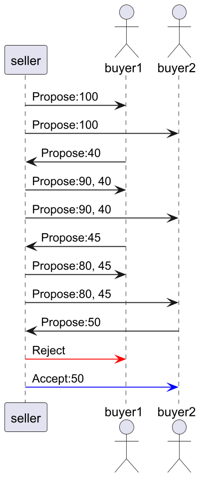

# Jade : TD1 - Négociation

## Exemple basique : la négociation 1-1 
 
---

Sur base du code sur le [PingPong](https://github.com/EmmanuelADAM/jade/blob/master/pingPong/), deux agents 
vendeur et acheteur négocient autour d'un prix.

Définissez les échanges de message sachant que le vendeur initie la négociation en proposant un prix.
 - Le vendeur dispose : 
   - d'un prix qu'il propose
   - d'un seuil sous lequel il met fin à la négociation
   - d'un nombre de tours avant de mettre fin à la négociation

 - L'acheteur dispose :
   - d'un prix qu'il propose
   - d'un seuil au-dessus lequel il met fin à la négociation
   - d'un nombre de tours avant de mettre fin à la négociation

 - pour l'acheteur : 
   - si le nb de tours dépasse le nb max, il répond avec un rejet ;
   - si le prix reçu est au-dessus du seuil haut, il répond avec un rejet ;
   - si le prix reçu semblable au prix proposé, il répond avec une confirmation ;
   - si le prix est entre le prix proposé et le seuil, l'acheteur augmente sa poposition initiale de x%.

- pour le vendeur :
  - si le nb de tours dépasse le nb max, il répond avec un rejet ;
  - si le prix reçu est sous le seuil bas, il répond avec un rejet ;
  - si le prix reçu semblable au prix proposé, il répond avec une confirmation ;
  - si le prix est entre le prix proposé et le seuil, le vendeur baisse sa poposition initiale de x%.

Regardez les classes proposées, et lancez le `main` de la classe `Main`.

---
**Question 1:** l'acheteur est un humain, modifiez la fenêtre du Buyer pour pouvoir saisir et proposer un prix. -1 arrêtera la négociation.
 
---
**Question 2:** Un vendeur et plusieurs acheteurs. 
  - Le vendeur propose un prix à chaque acheteur connu.
  - Lorsqu'un acheteur propose un prix, le vendeur l'annonce aux acheteurs avec son prix modidié ou sa décision.
    - rejet : seul l'acheteur ayant fait la dernière offre est retiré
    - acceptation : la vente est stoppée

<!--
```
@startuml multiNegociation
participant seller
actor buyer1
actor buyer2
seller -> buyer1 : Propose:100
seller -> buyer2 : Propose:100
seller <- buyer1 : Propose:40
seller -> buyer1 : Propose:90, 40
seller -> buyer2 : Propose:90, 40
seller <- buyer1 : Propose:45
seller -> buyer1 : Propose:80, 45
seller -> buyer2 : Propose:80, 45
seller <- buyer2 : Propose:50
seller -[#red]> buyer1 : Reject
seller -[#blue]> buyer2 : Accept:50
@enduml
```
-->



---
**Question 3:** le vendeur doit être paramétrable (prix proposé, prix min, nb de cycles).


---