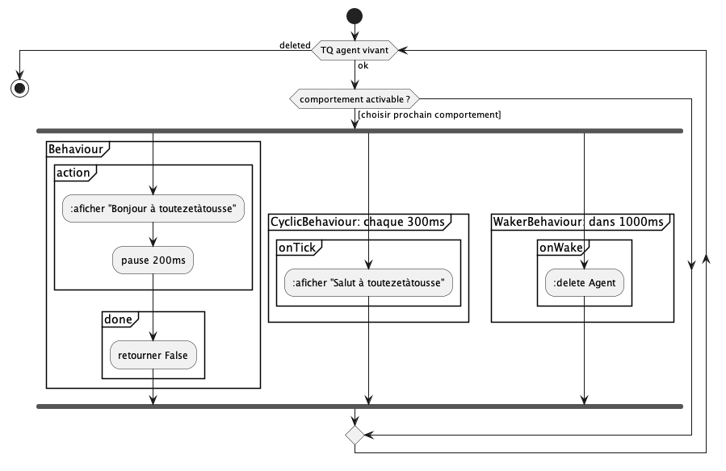

# Jade : Agents

## Exemple de comportements sur un agent "Hello World"

---

- [AgentHelloSalut](https://github.com/EmmanuelADAM/jade/blob/master/testComp01/AgentHelloSalut.java) : code pour un
  agent qui possède 3 comportements :
    - un comportement affichant "bonjour", sans fin
    - un comportement cyclique avec activation toutes les 300ms
    - un comportement "à retardement" provoquant l'arrêt de l'agent au bout de 1000ms
    - au commencement, 2 agents sont lancés.
<!--
```
@startuml helloSalut

start
while (TQ agent vivant) is (ok)
if (comportement activable ?) then ([choisir prochain comportement])
    fork
    partition "Behaviour" {
      partition "action" {
          ::aficher "Bonjour à toutezetàtousse";
          :pause 200ms;
      }
      partition "done" {
          :retourner False;
      }
    }
    fork again
    partition "CyclicBehaviour: chaque 300ms" {
      partition "onTick" {
          ::aficher "Salut à toutezetàtousse";
      }
    }
    fork again
    partition "WakerBehaviour: dans 1000ms" {
      partition "onWake" {
          ::delete Agent;
      }
    }
    end fork
 endif
  endwhile (deleted)
stop

@enduml```
-->



- [AgentHelloEuropeenParallel](https://github.com/EmmanuelADAM/jade/blob/master/testComp01/AgentHelloEuropeenParallel.java) :
  code pour deux agent qui possèdent contient des comportements s'exécutant en **parallèle**. Ces comportments
  s'exécutent 3 fois
    - ils affichent des salutations dans différentes langues européennes..

```a1 -> bonjour
a2 -> bonjour
a1 -> hallo
a2 -> hallo
a1 -> buongiorno
a2 -> buongiorno
a1 -> buenos dias
a2 -> buenos dias
a1 -> Olá
a1 -> saluton
a2 -> Olá
a1 -> bonjour
a2 -> saluton
a1 -> hallo
a2 -> bonjour
a2 -> hallo
a1 -> buongiorno
...
```

- [AgentHelloEuropeenSequentiel](https://github.com/EmmanuelADAM/jade/blob/master/testComp01/AgentHelloEuropeenSequentiel.java) :
  code pour deux agent qui possèdent contient des comportements s'exécutant en **séquentiel**. Ces comportments
  s'exécutent 3 fois
    - ils affichent des salutations dans différentes langues européennes..

```a2 -> bonjour
a2 -> bonjour
a2 -> bonjour
a2 -> hallo
a2 -> hallo
a2 -> hallo
a2 -> buongiorno
a2 -> buongiorno
a2 -> buongiorno
a2 -> buenos dias
a2 -> buenos dias
a2 -> buenos dias
a2 -> Olá
a2 -> Olá
a2 -> Olá
a2 -> saluton
a2 -> saluton
a1 -> bonjour
a2 -> saluton
...
```
