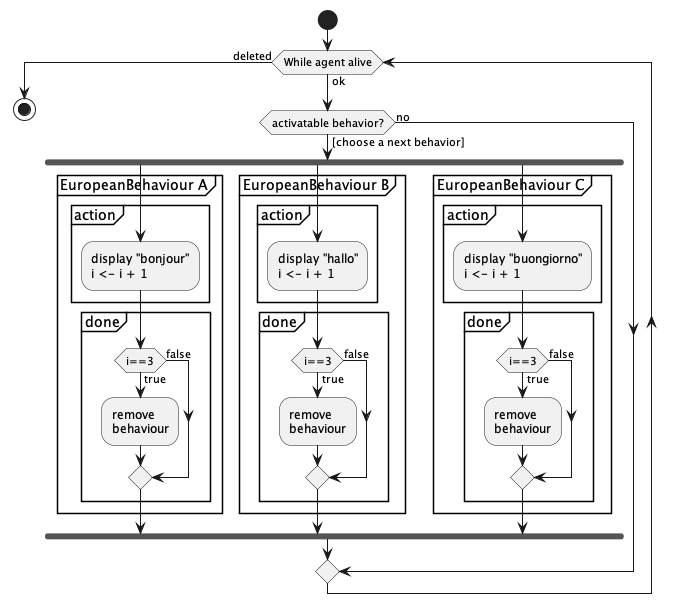

# Jade : Agents

## Exemple de comportements sur un agent "Hello World"

---

- [AgentHelloSalut](https://github.com/EmmanuelADAM/jade/blob/master/testComp01/AgentHelloSalut.java) : code pour un
  agent qui possède 3 comportements :
    - un comportement affichant "bonjour", sans fin
    - un comportement cyclique avec activation toutes les 300ms
    - un comportement "à retardement" provoquant l'arrêt de l'agent au bout de 1000ms
    - au commencement, 2 agents sont lancés.
<!--
```
@startuml helloSalut

start
while (TQ agent vivant) is (ok)
if (comportement activable ?) then ([choisir prochain comportement])
    fork
    partition "Behaviour" {
      partition "action" {
          ::aficher "Bonjour à toutezetàtousse";
          :pause 200ms;
      }
      partition "done" {
          :retourner False;
      }
    }
    fork again
    partition "CyclicBehaviour: chaque 300ms" {
      partition "onTick" {
          ::aficher "Salut à toutezetàtousse";
      }
    }
    fork again
    partition "WakerBehaviour: dans 1000ms" {
      partition "onWake" {
          ::delete Agent;
      }
    }
    end fork
 endif
  endwhile (deleted)
stop

@enduml```
-->


- [AgentHelloEuropeenParallel](https://github.com/EmmanuelADAM/jade/blob/master/testComp01/AgentHelloEuropeenParallel.java) :
  code pour deux agent qui possèdent contient des comportements s'exécutant en **parallèle**. Ces comportments
  s'exécutent 3 fois et  affichent des salutations dans différentes langues européennes..
- JADE partage bien les ressources entre les agents, et pour chaque agent entre ses comportements s'exécutant en
  parallèle.

- Voici une vue du fonctionnement de comportements en séquentiel.


<!--
```
@startuml HelloEuropeenParallel

start
while (TQ agent vivant) is (ok)
if (comportement activable ?) then ([choisir prochain comportement])
    fork
    partition "EuropeanBehaviour A" {
      partition "action" {
          :aficher "bonjour"
          i <- i + 1;
      }
      partition "done" {
      if (i==3) then (return
  true)
        :remove 
        behaviour;
      else (return false)
      endif 
      }
    }
    fork again
    partition "EuropeanBehaviour B" {
      partition "action" {
          :aficher "hallo"
          i <- i + 1;
      }
      partition "done" {
      if (i==3) then (return
  true)
        :remove 
        behaviour;
      else (return false)
      endif 
      }
    }
    fork again
    partition "EuropeanBehaviour C" {
      partition "action" {
          :aficher "buongiorno"
          i <- i + 1;
      }
      partition "done" {
      if (i==3) then (return
  true)
        :remove 
        behaviour;
      else (return false)
      endif 
      }
    }
    end fork
 endif
  endwhile (deleted)
stop

@enduml```
-->



```
a1 -> bonjour 1 fois
a2 -> bonjour 1 fois
a1 -> hallo 1 fois
a2 -> hallo 1 fois
a1 -> buongiorno 1 fois
a2 -> buongiorno 1 fois
a1 -> buenos dias 1 fois
a2 -> buenos dias 1 fois
a1 -> Olá 1 fois
a2 -> Olá 1 fois
a1 -> saluton 1 fois
a2 -> saluton 1 fois
a1 -> bonjour 2 fois
a2 -> bonjour 2 fois
a1 -> hallo 2 fois
a2 -> hallo 2 fois
a1 -> buongiorno 2 fois
a2 -> buongiorno 2 fois
a1 -> buenos dias 2 fois
a2 -> buenos dias 2 fois
...
```

- [AgentHelloEuropeenSequentiel](https://github.com/EmmanuelADAM/jade/blob/master/testComp01/AgentHelloEuropeenSequentiel.java) :
  code pour deux agent qui possèdent contient des comportements s'exécutant en **séquentiel**. Ces comportments
  s'exécutent 3 fois  et  affichent des salutations dans différentes langues européennes..
- JADE partage bien les ressources entre les agents, et cette fois, pour chaque agent le même comportement est 
  appelé tant qu'il n'est pas terminé, les autres comportement s'exécutant dans l'ordre de leurs déclarations.

- Voici une vue du fonctionnement de comportements en séquentiel.
<!--
```
@startuml HelloEuropeenSequentiel

start
while (TQ agent vivant) is (ok)
  if (EuropeanBehaviour A 
  exists) then
    partition "EuropeanBehaviour A" {
      partition "action" {
          :aficher "bonjour"
          i <- i + 1;
      }
      partition "done" {
      if (i==3) then (return
  true)
        :remove 
        behaviour;
      else (return false)
      endif 
      }
    }
  elseif (EuropeanBehaviour B 
exists) then
    partition "EuropeanBehaviour B" {
      partition "action" {
          :aficher "hallo"
          i <- i + 1;
      }
      partition "done" {
      if (i==3) then (return
  true)
        :remove 
        behaviour;
      else (return false)
      endif 
      }
    }
  elseif (EuropeanBehaviour C 
exists) then
    partition "EuropeanBehaviour C" {
      partition "action" {
          :aficher "hallo"
          i <- i + 1;
      }
      partition "done" {
      if (i==3) then (return
  true)
        :remove 
        behaviour;
      else (return false)
      endif 
      }
    }
  endif
  endwhile (deleted)
stop

@enduml```
-->


```
a1 -> bonjour 1 fois
a2 -> bonjour 1 fois
a1 -> bonjour 2 fois
a2 -> bonjour 2 fois
a2 -> bonjour 3 fois
a1 -> bonjour 3 fois
a2 -> hallo 1 fois
a1 -> hallo 1 fois
a2 -> hallo 2 fois
a1 -> hallo 2 fois
a2 -> hallo 3 fois
a1 -> hallo 3 fois
a2 -> buongiorno 1 fois
a1 -> buongiorno 1 fois
a2 -> buongiorno 2 fois
a1 -> buongiorno 2 fois
a2 -> buongiorno 3 fois
a1 -> buongiorno 3 fois
a2 -> buenos dias 1 fois
a1 -> buenos dias 1 fois
a2 -> buenos dias 2 fois
a1 -> buenos dias 2 fois
a2 -> buenos dias 3 fois
a1 -> buenos dias 3 fois
a2 -> Olá 1 fois
...
```