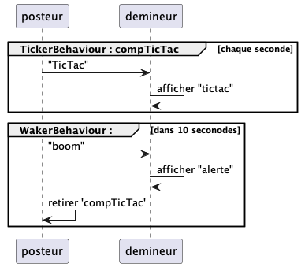

# Jade : Agents

## Exemple de filtrage de message dans les boites aux lettres

---

- [AgentPosteur](https://github.com/EmmanuelADAM/jade/blob/master/ticTac/AgentPosteur.java) : est une classe pour un
  agent qui possède 2 comportements de communication :
    - un comportement cyclique qui toutes les 1000ms émet un message taggé "CLOCK"
    - un comportement à retardement qui au bout de 10000ms émet un message taggé "BOOM"
- [AgentDemineur](https://github.com/EmmanuelADAM/jade/blob/master/ticTac/AgentDemineur.java) : est une classe pour un
  agent piochant dans sa boite aux lettres des messages de différents types (CLOCK, BOOM).
- [LaunchAgents](https://https://github.com/EmmanuelADAM/jade/blob/master/protocoles/voteBorda/launch/LaunchAgents.java) : **
  classe principale**, lançant Jade et créant 2 agents

<!--
```
@startuml tictac
participant posteur
participant demineur
par envoyer tictac
  loop chaque seconde
  posteur -> demineur  : TicTac
  end
end

par envoyer boom 10 sec plus tard
    posteur -> demineur: boom
    posteur -> posteur : retirer 'envoyer tictac'
end

@enduml```
-->

