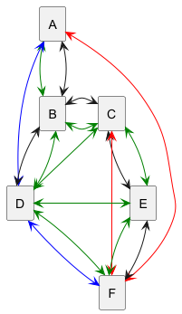

# Jade : Agents

## Voyages en ville

---

Ces codes illustrent un petit cas d'étude permettant de manipuler le protocole de ContractNet.

Un voyageur souhaite aller d'un point `a` à un point `b` :

- il lance un appel d'offre à plusieurs agences de voyages,
- certaines sont spécialisées dans les vélos, les bus, les trains ou les voitures.
- ces agences envoient leurs catalogues de voyages possibles
- le client fait son choix et peut combiner différentes offres selon ses critères (coûts, temps, émission de CO2, ...)


- Des classes sont déjà proposées :
    - La classe [AgenceAgent](https://github.com/EmmanuelADAM/jade/blob/master/voyagesEnVille/agents/AgenceAgent.java) est
      une classe représentant une agence de voyage. Une agence dispose d'un catalogue de voyages qu'elle crée à partir
      d'un fichier csv (bus.csv, car.csv ou train.csv).
    - La
      classe [TravellerAgent](https://github.com/EmmanuelADAM/jade/blob/master/voyagesEnVille/agents/TravellerAgent.java)
      représente le client, qui émet l'appel d'offres et effectue son choix *(à modifier pour le choix par durée)*, 
    - La classe [AlertAgent](https://github.com/EmmanuelADAM/jade/blob/master/voyagesEnVille/agents/AlertAgent.java)
      représente un agent capable d'émettre un appel radio (broadcast) signalant une alerte sur un tronçon de route.
    - La classe [LaunchSimu](https://github.com/EmmanuelADAM/jade/blob/master/voyagesEnVille/launch/LaunchSimu.java) lance
      un client, 3 agents agence de voyages spécialisée, et 1 agent d'alertes.
    - La
      classe [ContractNetVente](https://github.com/EmmanuelADAM/jade/blob/master/voyagesEnVille/comportements/ContractNetVente.java)
      code le comportement de réponse à un appel d'offre, il consiste simplement à envoyer le catalogue complet des
      voyages, il peut être optimisé.
    - La
      classe [ContractNetAchat](https://github.com/EmmanuelADAM/jade/blob/master/voyagesEnVille/comportements/ContractNetAchat.java)
      code le comportement de lancement et de gestion d'un appel d'offres.

- Dans le package [voyagesEnVille.data](https://github.com/EmmanuelADAM/jade/tree/master/voyagesEnVille/data) se trouvent
  les classes qui consruisent les chemins possibles.
- Dans le package [voyagesEnVille.gui](https://github.com/EmmanuelADAM/jade/tree/master/voyagesEnVille/gui) se trouvent
  les classes qui consruisent les feneêtre de dialogue avec les voyagesEnVille.agents.

  
Le code utilise
- la librairie opencsv
- la librairie json
- la librairie jadeUPHF.
- Ces librairies sont dans le répertoire [external-libraries](https://github.com/EmmanuelADAM/jade/tree/english/external-libraries)

-----
Le code s'exécute tel quel, mais le client ne peut effectuer qu'un choix par durée la plus courte parmi les voyages
proposés.

- **Proposez et codez** la décrémentation du nb de places par voyage : 
  - on pose 3 places par trajet en voiture, 20 vélos disponibles dans chaque zone, 50 places dans un bus, et 200 places dans un tram,
  - lorsqu'un voyage est choisi, le nombre de places disponibles est décrémenté,
  - si le nombre de places disponibles est nul, le voyage n'est plus proposé. *(+5 points pour cette fonctionnalité)*
  - cas particulier des vélos : à l'utilisation d'un vélo, le nombre de vélos dans la ville de départ est décrémenté, et il est incrémenté dans la ville d'arrivée **après la date d'arrivée (il sera rendu accessible après la date d'arrivée prévue)** *(+5 points pour cette fonctionnalité)*.
- Prise en compte de la météo : 
  - si pluie et/ou vent très fort, les trajets en vélo ne sont pas proposés,
  - si vent fort, les trajets en vélo sont proposés avec un temps majoré de 50%,
  - si neige, les trajets en voiture sont proposés avec un temps majoré de 50% et un coût majoré de 20%.
  - **utilisez l'[api openweathermap](https://openweathermap.org/)** :inscription gratuite ici : [home.openweathermap.org/users/sign_up](https://home.openweathermap.org/users/sign_up) (60 utilisations / minute gratuites). Voir le détail des champs récupérables ici : [openweathermap.org/current](https://openweathermap.org/current). Voir l'exemple dans la classe [Meteo.java](https://github.com/EmmanuelADAM/jade/blob/english/ollama/Meteo.java) (inidiquez votre clé dans le code).
    - **Selon la météo** de la ville, les propositions de l'agent traveller doivent être adaptées. *(+5 points pour cette fonctionnalité)*
    
- **Amériorer le texte** : utilisez [Ollama] (https://ollama.com/) pour améliorer le texte des messages échangés entre l'agent traveller et l'humain. Voir l'exemple d'[un agent utilisant Ollama ici](https://github.com/EmmanuelADAM/jade/tree/english/ollama) - *(+5 points pour cette fonctionnalité)*

- **Amériorer la demande** : utilisez le llm de votre choix pour que l'utilisateur puisse formuler sa demande de voyage en"
  langage naturel (ex. "je veux aller de a à d avant 15h avec un budget de 20€ et en émettant le moins de CO2 possible"). *(+5 points pour cette fonctionnalité)*

- Proposez et codez le comportement de **réaction suite à la réception d'un message d'alerte** sur un tronçon donné - *(+5 points pour cette fonctionnalité)* : 
    - pour les agences (disparition des trajets impactés),
    - pour le client (relance d'une demande de trajet si impacté, achat des billets permettant de compléter le trajet).


-----

### Réseau de transport


Pour information, les trajets possibles sont les suivants :

- en véloroute (en vert dans la figure ci-dessous), entre les zones a--b, b--c, c--d, d--e, e--f
- en bus (en noir dans la figure ci-dessous), entre les zones a--b, b--c, b--d,  c--e et  e--f,
- en tram (en bleu dans la figure ci-dessous), entre les zones a--d, d--f,
- en voiture (covoiturage) (en rouge dans la figure ci-dessous), entre les zones a--f, c--f
- les coûts, vitesses, émissions de co2, confort ... dépendent du moyen utilisé, et du climat (pluie, vent, ...)


<!-- note, pour plantUml, ci-dessous retirer les espaces entre des tirets -- et le signe > 
```
@startuml trajetsV1
hide empty description
rectangle A
rectangle B
rectangle C
rectangle D
rectangle E
rectangle F
A <--[#green]> B
A <-- > B
A <-[#blue]> D
A <-[#red]> F
B <-[#green]> C
B <-> C
B <-> D
B <-[#green]> D
C <--[#green]> D
C <-> E
C <-[#green]> E
C <-[#red]> F
D <-[#green]> E
D <-[#blue]> F
D <-[#green]> F
E <--[#green]> F
E <-- > F


@enduml 
```

-->




---

## Autres agences

- Ajoutez 2 autres agences : l'une pour les bus utilisant les voyages de busAutre.csv, l'autre pour les voitures
  utilisant le fichier carAutre.csv
- Créez une classe PortailAgence. Une classe portail agence se comporte comme une agence, mais ne dispose pas de moyens
  de locomotion. Le client n'envoie plus de demande auprès des agences, mais auprès des portails.
- Créez un agent PortailBus qui sert d'intermédiaire entre les clients et les bus, et un agent PortailCar qui fait de
  même pour les agences de voiture. L'agent agence de train, se définit lui-même comme une agence..

- un achat auprès d'un portail est répercuté au niveau de l'agence.

> si code portail correct => + 5 points

Voici la nouvelle offre de voyage (en orange pour la 2e agence de voiture, en gris pour la 2e agence de bus)

<!-- note, pour plantUml, ci-dessous retirer les espaces entre deux tirets -- et le signe > 
```
@startuml trajetsV2
hide empty description
rectangle A
rectangle B
rectangle C
rectangle D
rectangle E
rectangle F
A <-- > B
A <--[#grey]> B
A <-[#blue]> D
B <-> C
B <-[#grey]> C
B <-> D
B <-[#grey]> D
C <-- > D
C <--[#grey]> D
C <-> E
C <-[#grey]> E
D <-> E
D <-[#grey]> E
D <-[#blue]> F
A <-[#red]> F
C <-[#red]> F
E <-- > F
B <--[#orange]> F
A <--[#orange]> E


@enduml
```

-->


---
### Rapport à rendre

Vous associerez votre remise de codes d'un court rapport contenant :
- un diagramme de classes, contenant les classes sur les agents et leurs comportements
- de diagrammes de séquences détaillant la recherche de voyages, les appels à l'api meteo et au llm 

Vous pouvez vous baser sur les exemples de diagrammes illustrant les codes dans ce dépôt github  ; ainsi que sur les codes PlantUML associé (si vous souhaitez uitiliser cet outil pour la création de diagrammes).


---

